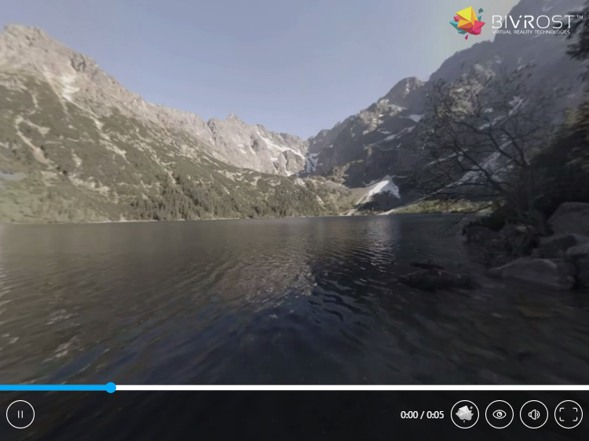
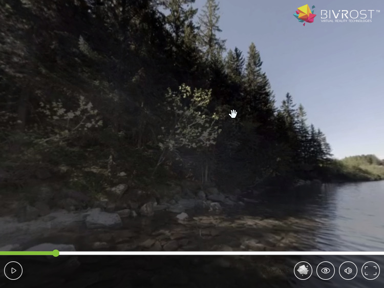

BIVROST 360WebPlayer
====================


The [BIVROST][bivrost-website] 360WebPlayer is the easiest way to stream 360 videos and pictures on your website or blog.

This player is a part of our large family of [video players][player-windows] so you can watch 360° videos on all platforms. It is part of our end-to-end solution for 360° video. Our other products include the [professional custom camera rigs][camera] and the [BIVROST software suite][stitcher].

You can watch a demo of the video player [here][live-demo].

[player-windows]: https://download.bivrost360.com/player-desktop/?campaign=player-web-ref
[bivrost-website]: https://bivrost360.com
[live-demo]: https://tools.bivrost360.com/webplayer-docs
[camera]: https://bivrost360.com#TODO
[stitcher]: https://bivrost360.com#TODO
[wordpress-plugin]: https://bivrost360.com#TODO


Features
--------

* Fast integration into any web site.
* Easy to use for the end user.
* Both desktop and mobile.
* Free for personal use (see [license][license-free] for details).
* Works on all major browsers.
* Possible to embed more than one player on the same page.
* Mono and stereoscopic video and pictures.
* HTTP Live Streaming (HLS).
* [WebVR][webvr] (MozVR) support - works with Oculus Rift, Cardboard and more.
* Supports watching content in external native players ([by Bivrost][player-windows]).
* Available as a [WordPress plugin][wordpress-plugin].
* We want to hear your feedback and ideas for new features, to make it even better.


Quickstart
----------

1.	[Download][download-link] the 360WebPlayer and unpack it to `bivrost_dir`
2.	Copy / paste:

	```html
	<link rel="stylesheet" href="bivrost_dir/bivrost.css" />
	<script type="text/javascript" src="bivrost_dir/bivrost-min.js"></script>
	<bivrost-player url="stereoscopic_movie_SbS.mp4"></bivrost-player>
	```
3.	Enjoy. 


### How does it work?

All configurations are autodetected. For example the `.mp4` extension means it's a video and the `SbS` keyword says it's side by side stereoscopy. Equirectangular projection is the default.

Everything is included in the css and js files. There are no additional downloads.

The 360WebPlayer’s default options will cover most use cases.

Installation
------------

1. Download the JS and CSS files [here][download-link] and put it on your server.
2. Link to the CSS and JS files anywhere in the HTML (for example in the head):
```html
<link rel="stylesheet" href="bivrost.css" />
<script type="text/javascript" src="bivrost-min.js"></script>
```
Don't forget to set the correct paths.
3. [Configure video player][configuration]
4. [Encode media][media-preparation-guide]

[download-link]: https://github.com/Bivrost/360WebPlayer/releases
[configuration]: #configuration
[media-preparation-guide]: #media-preparation-guide


Configuration
-------------

Following configuration options are allowed:

*	`url`: media address, can be multiple addresses when you have alternative sources (translates to `source` tag of HTML5 `video` or `img` if a picture); At least one `url` attribute or `bivrost-media` tag is required.

*	`type`: media mime types and codec information. The format is the same as in HTML5 video; optional, ignored on pictures.

*	`loop`: allows the video to loop 
	Allowed values: "true", "false";  
	optional, default: "false".

*	`autoplay`: should the content play automatically? This might not work with some platforms.
	Allowed values: "true", "false";  
	optional, default: "true".

*	`stereoscopy`: which form of stereoscopy is used?  
	Allowed values:  
	
	* "autodetect" - detects by filename tags and media ratio (see: Media preparation guide), 
	* "mono" - whole image used,
	* "side-by-side" - the image for left eye is on the left half, and right on the right half of the media,
	* "top-and-bottom" - the left eye is the top half of the image, the right one on the bottom half,
 	* "top-and-bottom-reversed" - the left eye is the bottom half of the image, the right one on the top half;

	optional, default: "autodetect".

*	`source`: is it a video or picture?
	Allowed values: "video", "picture", "stream-hls", "autodetect";
	optional, default: "autodetect"

	Warning: When using HLS, you have to include the [HLS.js][hls-js] third party library.
	
*	`projection`: how is the media projected (mapping from 2d to 3d)?
	Allowed value: "equirectangular", "cubemap", "cubemap:configuration...";
	optional, default: "equirectangular".
	Cubemap can be configured through several cubemap types. There are a few presets defining the order: 

	* "horizontal" (default) - all sides of the cube are in one line in the following order; left, right, down, up, back, front. OBRX uses this format.
	* "two-by-three" - all sides are in two rows: left, right, down and up, bottom, front. Facebook 360 videos use this format.
	* "facebook" - the same as two-by-three, but rotated, and each face is cropped by 1%.
	* "horizontal-cross" - all sides are in a cross with bottom, right, front and left in the middle row; up is in the top row and down in the bottom. 
	* "vertical-cross" - up is in the first row, bottom, right and front in the second, left in the third and down in the fourth. ATI CubeMapGen uses this format.
	* custom - advanced, please use presets if possible; you can specify any alignment with a description string. The string is an 2d array of face names in the order they appear on the texture. The rows are separated by "," and the faces are one letter acronyms (accepts capital letters):

		*  "f" - front
		*  "b" - back
		*  "l" - left
		*  "r" - right
		*  "u" - up
		*  "d" - down
		*  "-" - unused space

	Each face can be rotated with `*x`.  x is a number from 0 to 3. For example `r*1` is right rotated 90 degrees clockwise.

	There are optional modifiers at the end of the string:

	*  ">90" - rotate the whole cube clockwise by 90 degrees
	*  "<72" - rotate the whole cube counter clockwise by 72 degrees
	*  "+0.01" - crop faces by 0.01 (prevents visible edges)

	Example: `-u--,blfr,-d*2-->90+0.002`
	
	Please note that with cubemaps, seams can be visible due to texture filtering - this is most visible on horizontal and vertical crosses. It's best you fix them on pictures by duplicating a border into the unused part of the image. The 1% zoom with Facebook is to prevent this from happening.

Apart from that, you can tune down the player console information with `Bivrost.verbose=false` in your script.

The player can be run and configured in two ways:

[hls-js]: https://github.com/dailymotion/hls.js/#dependencies


### Declarative configuration

Preferred. Use as Web Component with a dedicated HTML5 tag:

```html
<bivrost-player url="stereoscopic-media_LR.mp4"></bivrost>
```

Or with more configuration:

```html
<bivrost-player 
		loop="false" 
		autoplay="true" 
		stereoscopy="autodetect" 
		projection="equirectangular" 
		source="autodetect">
	<bivrost-media 
			url="scenes/morskie-oko/morskie-oko-mono.mp4" 
			type="video/mp4; codecs=avc1.640033, mp4a.40.2">
	</bivrost-media>
	<bivrost-media 
			url="scenes/morskie-oko/morskie-oko-mono.webm" 
			type="video/webm; codecs=vp8.0">
	</bivrost-media>
</bivrost-player>
```

The `url` can be placed on the top `bivrost-player` tag and/or in children `bivrost-media` tags. This provides the browser with alternative video formats. The `type` attribute is optional.

All content of the `bivrost-player` tag will be removed and future changes in attributes of the tag will be ignored. You have to use the JavaScript API to modify them in runtime.

**NOTE:** if you cannot use a custom tag, there is an alternative notation using HTML5 data attributes:

```html
<div data-bivrost-player data-bivrost-url="stereoscopic-media_LR.mp4"></div>
```

or for a full example:

```html
<div	data-bivrost-player
		data-bivrost-loop="true" 
		data-bivrost-autoplay="true" 
		data-bivrost-stereoscopy="autodetect" 
		data-bivrost-projection="equirectangular" 
		data-bivrost-source="autodetect">
	<div	data-bivrost-media
			data-bivrost-url="scenes/morskie-oko/morskie-oko-mono.mp4" 
			data-bivrost-type="video/mp4; codecs=avc1.640033, mp4a.40.2">
	</div>
	<div	data-bivrost-media 
			data-bivrost-url="scenes/morskie-oko/morskie-oko-mono.web" 
			data-bivrost-type="video/webm; codecs=vp8.0">
	</div>
</div>
```

**NOTE 2:** the ending tags on `bivrost-player`, `bivrost-media` or `div` tags are mandatory. The self-closing slash in `<tag />` notation is considered syntactic sugar in HTML5. This is called a non-void element in the W3C reference.


### JavaScript configuration

All the above can also be written in a script. While it's less cool than the custom tag, it works just as good.

```javascript
// Creates a new player
var player=new Bivrost.Player(

	// The containing element for the player, all children will be removed.
	document.getElementById("bivrost-container"),

	// Urls for the media, an object where keys are relative urls,
	// and values are media types. The type may be null.
	// As a shorthand you can provide a single string instead of an object.
	{
		"video.mp4": "video/mp4; codecs=avc1.640033, mp4a.40.2",
		"video.webm": "video/webm; codecs=vp8.0",
		"video-2.mp4": null		// no type provided
	},

	// Projection - how is the media projected (mapping from 2d to 3d)?
	// Optional, available choices are:
	// Bivrost.PROJECTION_EQUIRECTANGULAR
	// Bivrost.PROJECTION_CUBEMAP
	// "cubemap:<cubemap definition>"
	// or ommit/provide undefined for equirectangular
	Bivrost.PROJECTION_EQUIRECTANGULAR,

	// What kind of Stereoscopy is the media in?
	// Optional, available choices are:
	//	Bivrost.STEREOSCOPY_AUTODETECT,
	//	Bivrost.STEREOSCOPY_MONO,
	//	Bivrost.STEREOSCOPY_SIDE_BY_SIDE,
	//	Bivrost.STEREOSCOPY_TOP_AND_BOTTOM,
	//	Bivrost.STEREOSCOPY_TOP_AND_BOTTOM_REVERSED
	// or ommit/provide undefined for autodetect
	Bivrost.STEREOSCOPY_AUTODETECT,

	// Source - is the media a picture or video?
	// Optional, available choices are:
	//  Bivrost.SOURCE_AUTODETECT,
	//  Bivrost.SOURCE_VIDEO,
	//  Bivrost.SOURCE_PICTURE
	//  Bivrost.SOURCE_STREAM_HLS
	// or ommit/provide undefined for autodetect
	Bivrost.SOURCE_AUTODETECT,

	// Loop - should the media loop? 
	// Optional, boolean, default false.
	false,
	
	// Autoplay - should the content play automatically? 
	// Optional, boolean, default true.
	true
);
```

### Player API

You can control the Bivrost Player using the `Bivrost.Player` instance. There are two ways to get the object:

1.	From the DOM node:
	```javascript
	var player=document.getElementById("bivrost-container").bivrost;
	```

2.	Returned from the `new Bivrost.Player(...)` statement:
	```javascript
	var player=new Bivrost.Player(url);
	```

Some interesting API methods:

* `player.view.zoom:number`: gets or sets the current zoom, default value is `1`, higher values zoom in, lower zoom out.

* `player.ui.show()`, `player.ui.hide()`: shows or hides the UI.

* `player.ui.autohide:number`: number of seconds of user inactivity after which the UI hides, set to `0` to never hide.

* `player.media.play()`: plays the movie

* `player.media.pause()`: pauses the movie

* `player.media.pauseToggle()`: plays or pauses the movie

* `player.media.rewind()`: resets the movie

* `player.media.time:number`: gets or sets the current time of the movie (in seconds).

* `player.media.duration:number`: gets the total time of the movie (in seconds).

* `player.media.loop:boolean`: gets or sets if the movie should loop.

* `player.input.clampY:boolean`: should user movement be constrained when he or she looks too far up or down, default true (does not restrict VR headset movement).

* `player.input.lookEuler:`[`THREE.Euler`][threejs-euler]: shows or sets the direction that the user is looking towards, does include VR headset movement (`vrLookQuaternion` is for that). The values are in radians.

* `player.input.keyboardSpeed:number`: gets or sets the speed in which the keyboard rotates the camera, value in radians per second. Default 2π/4 (full horizontal rotation in 4 seconds). 

* `player.fullscreen:boolean`: gets or sets if the player is displayed in fullscreen. Browsers require this to be called in a user event handler.

* `player.aspect:number`: gets or sets default aspect ratio, is overriden by styling (default 4/3).

* `Bivrost.Loader(domNode)`: if you changed a part of the HTML code and want it parsed for `bivrost-player` tags, you can call this static function on a dom node or `document.body`. Already parsed tags will not be parsed again.

* `Bivrost.verbose:boolean`: set to false to suppress log output.

* `Bivrost.version:string`: the current player version.


[threejs-euler]: http://threejs.org/docs/#Reference/Math/Euler


Themes
------

There are three themes available:

## Default




## Spring



You can change the theme by adding a `bivrost-theme-spring` class to the `bivrost-player` tag.


## Autumn


You can change the theme by adding a `bivrost-theme-autumn` class to the `bivrost-player` tag.


Media preparation guide
-----------------------


VR needs high definition content, at the same time browsers have strict guidelines and restrictions for portable media. 

We recommend VR creators to use mp4/h264 and webm/vp8 **content types** in at least full HD (1920 x 1080) when uploading content. In order to provide full compatibility we suggest to upload the content in both formats. We also advice content creators to
refrain from using ogv, because it requires more processing power to get the same results due to software decoding. If you have access to hardware this powerful it will support mp4.

For the **resolution** we advice you to use Full HD. This resolution is not perfect, but it will have to do. Working in 4k or 8k would be optimal, but this is often not supported on mobile or by many desktop computers. In odd cases 720p will do when the user does not toggle on full screen, but watches the content from the window.

As most hardware decoders work up to Full HD, we also recommend you to refrain from using the 2:1 **aspect ratio** and instead use the 16:9 ratio. Although this distorts the image (and the pixels are no longer square) we tell our users to not crop or letter box the content.

VR content requires a **high bitrate**: 10Mbps is the advised minimum for Full HD. For fast moving images and intense colors we recommend higher bitrates.

Some other tips:

* Set keyframes around 5 times per second. otherwise the movie will take forever to seek (ffmpeg's `-g` option).
* Make the movie streamable by putting the headers in the beginning of the file (ffmpeg's `+faststart` option).
* Codecs, especially h264, have lots of switches that should be used, for example using the yuv420p colorspace to keep a correct level and profile.
* Browsers prefer the H.264 and VP8 codec types over H.265 and VP9.

At Bivrost we use [ffmpeg][ffmpeg] in combination with these options for both web & mobile:

	ffmpeg -i input.mp4 -c:v libx264 -preset slow -crf 23 -vf scale=1920:1080 -movflags +faststart -pix_fmt yuv420p -g 5 -c:a aac -b:a 128k output.mp4

	ffmpeg -i input.mp4 -codec:v libvpx -b:v 10M -crf 10 -vf scale=1920:1080 -g 5 -c:a libvorbis -b:a 128k output.webm


If you want to know more, here are some good manuals to look into:

* https://wiki.whatwg.org/wiki/Video_type_parameters
* http://linux.goeszen.com/html5-video-tag-and-codecs.html
* https://trac.ffmpeg.org/wiki/Encode/H.264
* https://trac.ffmpeg.org/wiki/Encode/VP8


[ffmpeg]: https://www.ffmpeg.org/

For **static pictures**, use jpeg or png. Hugin's equirectangular or Google's Photo Sphere pictures work well if you stay below 4096 x 4096.

For examples [click here][live-demo].

Stereoscopy types
----------------- 

Stereoscopy is about which part of the media goes to which eye. This is done before projection.

When stereoscopy is set to "autodetect", it does so based on keywords in the filename and (if that fails) the image ratio.

Parts of the filename are separated by "_", "-" or other non-word characters. For example "stereoscopic-video_LR.mp4" has parts: "stereoscopic", "video", "LR" of which only "LR" is recognized and parsed.


#### Side By Side

```
[       |       ]
[ left  | right ]
[ eye   | eye   ]
[       |       ]
```

1. stereoscopy is set to "side-by-side" (or `Bivrost.STEREOSCOPY_SIDE_BY_SIDE`)
2. there is a "LR" or "SbS" part in the image filename
3. the image ratio is 4:1


#### Top And Bottom (over under)

```
[      left     ]
[      eye      ]
-----------------
[      right    ]
[      eye      ]
```

1. stereoscopy is set to "top-and-bottom" (or `Bivrost.STEREOSCOPY_TOP_AND_BOTTOM`)
2. there is a "TB" or "TaB" part in the image filename
3. the image ratio is 1:1


#### Top And Bottom Reversed

```
[      right    ]
[      eye      ]
-----------------
[      left     ]
[      eye      ]
```

1. stereoscopy is set to "top-and-bottom-reversed" (or `Bivrost.STEREOSCOPY_TOP_AND_BOTTOM_REVERSED`)


#### Mono

```
[               ]
[      both     ]
[      eyes     ]
[               ]
```

1. stereoscopy is set to "mono" (or `Bivrost.STEREOSCOPY_MONO`)
2. no other detection succeeded


User Guide
----------

### Available keyboard shortcuts:

* ` ↑ ` ` → ` ` ↓ ` ` ← ` - look around.
* ` space ` - pause/play.
* ` F ` or double click player - full-screen.
* ` V ` - enter/toggle VR mode.
 ` escape ` - exit full-screen/VR mode.
* ` [ `, ` ] ` - scroll movie by 5 seconds, forwards or backwards.
* ` + `, ` - ` - zoom in/out (not available in VR mode).


### Virtual Reality on desktop with WebVR

At the time of writing, WebVR is supported by Firefox Nightly. It supports Oculus Rift and other headsets like HTC Vive.

When you have a VR headset, press ` V ` or the VR button to go to VR mode.

[mozvr]: http://mozvr.com/downloads/
[webvr]: http://webvr.info/


### Virtual Reality on mobile with Google Cardboard

You can use the Bivrost 360Player with Google Cardboard and its many clones. Just press the "eye" button to go to VR mode.

Some tips:

* If you have a NFC tag in your Cardboard we advice you to disable NFC in your phone as it might run the cardboard app and turn off your browser.
* Not all phones have a gyroscope. If you have problems looking left and right, but up and down works, your phone does not have one. Instead your phone has a magnetometer, which does not work well with VR. Removing the magnet from the Cardboard improves the experience in this situation.
* Consider setting a longer time for screen timeout.


### Platform availability

We try to make the player run on as many platforms as possible. 

Currently unsupported platforms are:

* iOS
* Windows Phone
* GearVR

If you're experiencing problems with other recent platforms, please let us know.


### Video does not work

Check if your device supports this kind of video by playing it directly in the browser. Some devices support only up to 1920x1080 resolution.

Videos or pictures have to be served from the same domain or provide [Cross-Origin Resource Sharing][cors]. Some browsers do not support CORS well.

[cors]: https://developer.mozilla.org/en-US/docs/Web/HTTP/Access_control_CORS

Do not test from your local filesystem (the `file:///` protocol). You have to have a working webserver for the plugin to work.


### Seeking does not work

Either your webserver doesn't support [Content-Range][content-range] or there are issues with the video file. Some web servers do not have Content-Range support, for example the PHP built-in web server.

[content-range]: http://www.w3.org/Protocols/rfc2616/rfc2616-sec14.html#sec14.16


### Where can I submit feature requests or bug reports? Where can I find the unminified version?

Please send bugs and feature requests to our [GitHub][github]. The sources are located there too. Thanks a lot in advance for any and all feedback.

[github]: http://github.com/Bivrost/360WebPlayer


### Standalone players

Although browsers are the most accessible platforms, they are not all fully ready for VR - that is why we created a whole family of video players.

The BIVROST 360WebPlayer has a button that allows online content to be run in a native player. This enhances performance and gives the user a better experience than viewing the content straight from the browser. If the user does not have the player yet, he or she can download it through a pop-up.

The standalone player supports VR headsets, less latency, and better frame rates.


Roadmap
-------

- [x] Standalone web component
- [x] Mobile support - Android
- [ ] Posters - flat thumbnails for spherical video
- [ ] Multi-resolution video ("HD" button)
- [ ] MPEG-DASH support
- [ ] Support built-in media galleries and switching media
- [ ] Overlays - add content on top of your media
- [ ] More supported projections - frame, cylindrical, partial sphere mappings etc.
- [ ] Interactive overlays
- [ ] Mobile support - iOS
- [ ] Mobile support - Windows Phone
- [x] Video on Internet Exporer/Edge
- [ ] Smaller footprint
- [ ] 3d glasses stereoscopic display support (line by line, red cyan)

Please, post suggestions using the issue function. Do not forget to suggest a valid use case.


License
-------

There are two separate licenses to choose from:

1. [The free license][license-free] - for web sites that are non commercial
2. [The paid license][license-commercial] - for commercial web sites, one license per domain ([contact sales][email-sales] for payment).

If you want to remove or replace our branding, are unsure about which license applies to you, please [contact us for help and additional licensing options][email-sales].

[email-sales]: mailto:contact@bivrost360.com
[license-free]: LICENSE-free.md
[license-commercial]: LICENSE-commercial.md


Changelog
---------

2016-03-14: initial public release


Third party libraries
---------------------

The Bivrost Web Player uses third party libraries:

* [THREE.js][threejs] (MIT license)


[threejs]: http://threejs.org