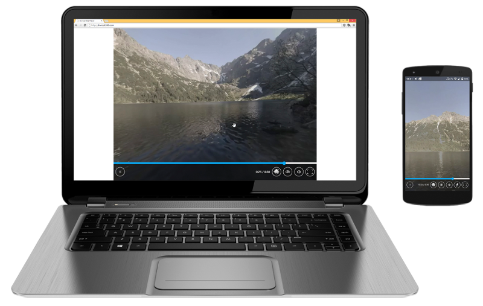
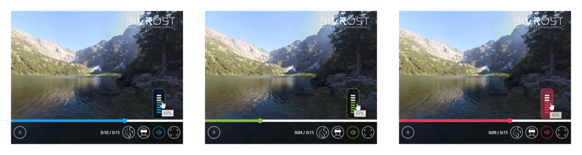
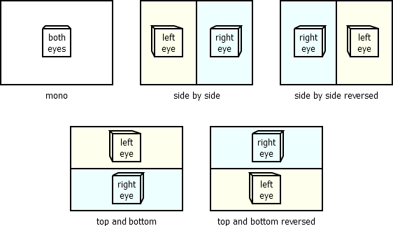

BIVROST 360WebPlayer
====================



The [BIVROST][bivrost-website] 360WebPlayer is the easiest way to stream 360 videos and pictures on your website or blog.

This player is a part of our [large family of video players][section-standalone-players] allowing you to watch 360° videos on all platforms. It is part of our end-to-end solution for 360° video. Our other products include professional custom camera rigs and the BIVROST software suite.


[player-windows]: https://download.bivrost360.com/player-desktop/?campaign=player-web-ref
[bivrost-website]: https://bivrost360.com
[wordpress-plugin]: https://github.com/BIVROST/360WebPlayer-for-WordPress

Quick links:
* [quickstart][section-quickstart]
* [download the latest release][section-download]
* [examples and live demo][section-examples]
* [development setup](DEVELOPMENT.md)


Features
--------

* Fast integration into any web site.
* Easy to use for the end user.
* Both desktop and mobile.
* Free for personal use (see [license][section-license] for details).
* Works on all major browsers and systems.
* Possible to embed more than one player on the same page.
* Mono and stereoscopic video and pictures.
* HTTP Live Streaming (HLS).
* Works well with touch.
* Well tested - supports many edge cases.
* [WebVR][webvr] support - works with Oculus Rift, Vive, Windows Mixed Reality, OSVR, GearVR, Google Cardboard and more.
* Supports watching content in external native players ([by Bivrost][player-windows]).
* Available as a [WordPress plugin][wordpress-plugin].

We want to hear your feedback and ideas for new features, to make it even better.


Examples
--------

[section-examples]: #examples

You can check out a live demo of the player at the [360WebPlayer samples page][live-demo].

[live-demo]: https://tools.bivrost360.com/webplayer-docs


Download
--------

The latest version is available on our [GitHub releases page][download-link], where you will be able to download the most recent version of the 360WebPlayer (click the header). 

You can also download the source code of the player (click the zip/tar.gz file below the text).  
Or use git to checkout: `https://github.com/BIVROST/360WebPlayer.git`.  
After you have the sources, build the player as described in the [development setup](DEVELOPMENT.md) document.

If you're interested in older releases, checkout [the Tags tab][download-link-tags].

[section-download]: #download
[download-link]: https://github.com/Bivrost/360WebPlayer/releases/tag/current
[download-link-tags]: https://github.com/Bivrost/360WebPlayer/releases/


Supported browsers
------------------


| OS      | Browser                     | Panorama viewing | Video playback | Video streaming (HLS) | Legacy VR⁵ | WebVR | Headsets supported                         |
| ------- | --------------------------- |:----------------:|:--------------:|:---------------------:|:----------:|:-----:| ------------------------------------------ |
| Windows | Google Chrome               | ✔                | ✔              | ✔                     |            | ✔¹    | Oculus, Vive, Windows Mixed Reality⁶       |
| Windows | Mozilla Firefox             | ✔                | ✔              | ✔                     |            | ✔²    | Oculus, OSVR, Vive, Windows Mixed Reality⁶ |
| Windows | Microsoft Edge              | ✔                | ✔              | ✔                     |            | ✔     | Windows Mixed Reality                      |
| Windows | Internet Explorer (11+)     | ✔                | ✔              | ✔                     |            |       |                                            |
| Mac OS  | Safari                      | ✔                | ✔⁴             | ✔                     |            |       |                                            |
| Mac OS  | Google Chrome               | ✔                | ✔              | ✔                     |            |       |                                            |
| Mac OS  | Mozilla Firefox             | ✔                | ✔              | ✔                     |            |       |                                            |
| Android | Mozilla Firefox             | ✔                | ✔              | ✔                     |            |       |                                            |
| Android | Google Chrome               | ✔                | ✔              | ✔                     | ✔          | ✔³    | Cardboard                                  |
| Android | Samsung Internet            | ✔                | ✔              |                       | ✔          |       | Cardboard                                  |
| Android | Samsung Internet for GearVR | ✔                | ✔              | ✔                     |            | ✔     | GearVR                                     |
| iOS     | Safari                      | ✔                | ✔              |                       | ✔          |       | Cardboard                                  |
| iOS     | Google Chrome               | ✔                | ✔              |                       | ✔          |       | Cardboard                                  |
| iOS     | Mozilla Firefox             | ✔                | ✔              |                       |            |       |                                            |

¹ - With a [dedicated WebVR Chromium build][webvr-chromium] or [Chrome Canary][webvr-chrome-canary]  
² - With [Firefox Nightly][webvr-firefox]  
³ - Requires enabling VR in `chrome://flags/#enable-webvr`  
⁴ - Movies must be on the same domain ([broken CORS implementation][video-does-not-work])  
⁵ - Split screen with orientation sensor support (basic Cardboard)  
⁶ - Windows Mixed Reality support via Microsoft's Windows Mixed Reality for SteamVR

[video-does-not-work]: #video-does-not-work


Quickstart
----------

[section-quickstart]: #quickstart

1.	[Download][section-download] the 360WebPlayer and unpack it to `bivrost_dir`
2.	Copy / paste:

	```html
	<link rel="stylesheet" href="bivrost_dir/bivrost.css" />
	<script type="text/javascript" src="bivrost_dir/bivrost-min.js"></script>
	<bivrost-player url="stereoscopic_movie_SbS.mp4"></bivrost-player>
	```
3.	Enjoy. 


### How does it work?

All configurations are autodetected. For example the `.mp4` extension means it's a video and the `SbS` keyword says it's side by side stereoscopy. Equirectangular projection is the default.

Everything is included in the css and js files. There are no additional downloads.

The 360WebPlayer’s default options will cover most of the possible scenarios.


Installation
------------

1. [Download the JS and CSS files][section-download] and put them on your server.
2. Link to the CSS and JS files anywhere in the HTML (for example in the head):
   ```html
   <link rel="stylesheet" href="bivrost.css" />
   <script type="text/javascript" src="bivrost-min.js"></script>
   ```
   Don't forget to set the correct paths.
3. [Configure the video player][configuration]
4. [Encode media][media-preparation-guide]

[configuration]: #configuration
[media-preparation-guide]: #media-preparation-guide


Configuration
-------------

Following configuration options are allowed:

*	`url`: media address, can be multiple addresses when you have alternative sources (translates to `source` tag of HTML5 `video` or `img` if a picture); At least one `url` attribute or `bivrost-media` tag is required. Multiple URLs are used only with the video, not with streaming nor photos.

*	`type`: media mime types and codec information. The format is the same as in HTML5 video; optional, ignored on pictures.

*	`loop`: allows the video to loop 
	Allowed values: `true`, `false`;  
	optional, default: `false`.

*	`autoplay`: should the content be played automatically? This might not work with some platforms.
	Allowed values: `true`, `false`;  
	optional, default: `true`.

*	`stereoscopy`: which form of stereoscopy is used?  
	Allowed values:  
	
	* `autodetect` - detects by filename tags and media ratio (see: Media preparation guide), 
	* `mono` - whole image used,
	* `side-by-side` - the image for the left eye is on the left half, and for the right on the right half of the media,
	* `top-and-bottom` - the left eye is the top half of the image, while the right one is on the bottom half,
 	* `top-and-bottom-reversed` - the left eye is on the bottom half of the image, while the right one is on the top half;

	optional, default: `autodetect`.

*	`source`: is it a video, a picture or a stream?
	Allowed values: `video`, `picture`, `stream-hls`, `autodetect`;
	optional, default: `autodetect`

	Warning: When using HLS, you have to include the [HLS.js][hls-js] third party library.
	
*	`projection`: how is the media projected (mapping from 2d to 3d)?
	Allowed value: `equirectangular`, `dome`, `frame`, `cubemap`, `cubemap:configuration...`;
	optional, default: `equirectangular`.

	* `equirectangular` is the default value, it is a 360 by 180 degree image with all horizontal and vertical lines preserved

	* `dome` is the front half of an equirectangular image (it is 180 by 180 degree).

	* `frame` is a frame hovering in front of the viewer, like a normal floating image.

	* `cubemap` can be configured through several cubemap types. There are a few presets defining the order: 

		* `horizontal` (default) - all sides of the cube are in one line in the following order; left, right, down, up, back, front. OBRX uses this format.
		* `two-by-three` - all sides are in two rows: left, right, down and up, bottom, front Facebook 360 videos use this format.
		* `facebook` - the same as two-by-three, but rotated. Each face is cropped by 1%.
		* `horizontal-cross` - all sides are in a cross with bottom, right, front and left in the middle row; up is in the top row and down in the bottom. 
		* `vertical-cross` - up is in the first row, bottom, right and front in the second left in the third and down in the fourth. ATI CubeMapGen uses this format`
		* custom - advanced, please use presets if possible; you can specify any alignment with a description string. The string is an 2d array of face names in the order they appear on the texture. The rows are separated by "," and the faces are one letter acronyms (accepts capital letters):

			*  `f` - front
			*  `b` - back
			*  `l` - left
			*  `r` - right
			*  `u` - up
			*  `d` - down
			*  `-` - unused space

		Each face can be rotated with `*x`.  x is a number from 0 to 3. For example `r*1` is right rotated 90 degrees clockwise.

		There are optional modifiers at the end of the string:

		*  `>90` - rotate the whole cube clockwise by 90 degrees
		*  `<72` - rotate the whole cube counter clockwise by 72 degrees
		*  `+0.01` - crop faces by 0.01 (prevents visible edges)

		Example: `-u--,blfr,-d*2-->90+0.002`

		Please note that with cubemaps, seams can be visible due to texture filtering - this is most visible on horizontal and 
		vertical crosses. It's best you fix them on pictures by duplicating a border into the unused part of the image. 
		The 1% zoom with Facebook is to prevent this from happening.

Apart from that, you can tune up the player console information with `Bivrost.verbose=true` in just after including 360WebPlayer .js files

The player can be run and configured in two ways:

[hls-js]: https://github.com/dailymotion/hls.js/#dependencies


### Declarative configuration

Preferred. Use as Web Component with a dedicated HTML5 tag:

```html
<bivrost-player url="stereoscopic-media_LR.mp4"></bivrost-player>
```

Or with more configuration:

```html
<bivrost-player 
		loop="false" 
		autoplay="true" 
		stereoscopy="autodetect" 
		projection="equirectangular" 
		source="autodetect">
	<bivrost-media 
			url="scenes/morskie-oko/morskie-oko-mono.mp4" 
			type="video/mp4; codecs=avc1.640033, mp4a.40.2">
	</bivrost-media>
	<bivrost-media 
			url="scenes/morskie-oko/morskie-oko-mono.webm" 
			type="video/webm; codecs=vp8.0">
	</bivrost-media>
</bivrost-player>
```

The `url` can be placed on the top `bivrost-player` tag and/or in children `bivrost-media` tags. This provides the browser with alternative video formats. The `type` attribute is optional.

All content of the `bivrost-player` tag will be removed and future changes in attributes of the tag will be ignored. You have to use the JavaScript API to modify them in runtime.

**NOTE:** if you cannot use a custom tag, there is an alternative notation using HTML5 data attributes:

```html
<div data-bivrost-player data-bivrost-url="stereoscopic-media_LR.mp4"></div>
```

or for a full example:

```html
<div	data-bivrost-player
		data-bivrost-loop="true" 
		data-bivrost-autoplay="true" 
		data-bivrost-stereoscopy="autodetect" 
		data-bivrost-projection="equirectangular" 
		data-bivrost-source="autodetect">
	<div	data-bivrost-media
			data-bivrost-url="scenes/morskie-oko/morskie-oko-mono.mp4" 
			data-bivrost-type="video/mp4; codecs=avc1.640033, mp4a.40.2">
	</div>
	<div	data-bivrost-media 
			data-bivrost-url="scenes/morskie-oko/morskie-oko-mono.web" 
			data-bivrost-type="video/webm; codecs=vp8.0">
	</div>
</div>
```

**NOTE 2:** the ending tags on `bivrost-player`, `bivrost-media` or `div` tags are mandatory. The self-closing slash in `<tag />` notation is considered syntactic sugar in HTML5. This is called a non-void element in the W3C reference.


### JavaScript configuration

All the above can also be written in a script. While it's less cool than the custom tag, it works just as good.

```javascript
// Creates a new player
var player=new Bivrost.Player(

	// The containing element for the player, all children will be removed.
	document.getElementById("bivrost-container"),

	// Urls for the media, an object where keys are relative urls,
	// and values are media types. The type may be null.
	// As a shorthand you can provide a single string instead of an object.
	{
		"video.mp4": "video/mp4; codecs=avc1.640033, mp4a.40.2",
		"video.webm": "video/webm; codecs=vp8.0",
		"video-2.mp4": null		// no type provided
	},

	// Projection - how is the media projected (mapping from 2d to 3d)?
	// Optional, available choices are:
	// Bivrost.PROJECTION_EQUIRECTANGULAR
	// Bivrost.PROJECTION_DOME
	// Bivrost.PROJECTION_CUBEMAP
	// "cubemap:<cubemap definition>"
	// or ommit/provide undefined for equirectangular
	Bivrost.PROJECTION_EQUIRECTANGULAR,

	// What kind of Stereoscopy is the media in?
	// Optional, available choices are:
	//	Bivrost.STEREOSCOPY_AUTODETECT,
	//	Bivrost.STEREOSCOPY_MONO,
	//	Bivrost.STEREOSCOPY_SIDE_BY_SIDE,
	//	Bivrost.STEREOSCOPY_TOP_AND_BOTTOM,
	//	Bivrost.STEREOSCOPY_TOP_AND_BOTTOM_REVERSED
	// or ommit/provide undefined for autodetect
	Bivrost.STEREOSCOPY_AUTODETECT,

	// Source - is the media a picture or video?
	// Optional, available choices are:
	//  Bivrost.SOURCE_AUTODETECT,
	//  Bivrost.SOURCE_VIDEO,
	//  Bivrost.SOURCE_PICTURE
	//  Bivrost.SOURCE_STREAM_HLS
	// or ommit/provide undefined for autodetect
	Bivrost.SOURCE_AUTODETECT,

	// Loop - should the media loop? 
	// Optional, boolean, default false.
	false,
	
	// Autoplay - should the content play automatically? 
	// Optional, boolean, default true.
	true
);
```

### Player API

You can control the Bivrost Player using the `Bivrost.Player` instance. There are two ways to get the object:

1.	From the DOM node:
	```javascript
	var player=document.getElementById("bivrost-container").bivrost;
	```

2.	Returned from the `new Bivrost.Player(...)` statement:
	```javascript
	var player=new Bivrost.Player(url);
	```

Some interesting API methods:

* `player.view.zoom:number`: gets or sets the current zoom, default value is `1`, higher values zoom in, lower zoom out.

* `player.ui.autohide:number`: number of seconds of user inactivity after which the UI hides, set to `0` to never hide.

* `player.media.play()`: plays the video

* `player.media.pause()`: pauses the video

* `player.media.pauseToggle()`: plays or pauses the video

* `player.media.paused`: gets or sets current pause state

* `player.media.rewind()`: resets the video

* `player.media.time:number`: gets or sets the current time of the video (in seconds).

* `player.media.duration:number`: gets the total time of the video (in seconds), will be infinite in streams.

* `player.media.loop:boolean`: gets or sets if the video should loop.

* `player.input.clampY:boolean`: should user movement be constrained when he or she looks too far up or down, default true (does not restrict VR headset movement).

* `player.input.lookEuler:`[`THREE.Euler`][threejs-euler]: shows or sets the direction that the user is looking towards, does include VR headset movement (`vrLookQuaternion` is for that). The values are in radians.

* `player.input.keyboardSpeed:number`: gets or sets the speed in which the keyboard rotates the camera, value in radians per second. Default 2π/4 (full horizontal rotation in 4 seconds). 

* `player.fullscreen:boolean`: gets or sets if the player is displayed in fullscreen. Browsers require this to be called in a user event handler.

* `player.aspect:number`: gets or sets default aspect ratio, is overriden by styling (default 4/3).

* `Bivrost.Loader(domNode)`: if you changed a part of the HTML code and want it parsed for `bivrost-player` tags, you can call this static function on a dom node or `document.body`. Already parsed tags will not be parsed again.

* `Bivrost.verbose:boolean`: set to false to suppress log output.

* `Bivrost.version:string`: the current player version.


[threejs-euler]: http://threejs.org/docs/#Reference/Math/Euler


Themes and personalization
--------------------------

There are three themes available:




## Default theme

The colour of the default theme is blue. It does not require any additional configuration.


## Spring theme

The colour of the spring theme is green. 
You can change the theme by adding the `bivrost-theme-spring` class to the `bivrost-player` tag.


## Autumn theme

The colour of the autumn theme is red. 
You can change the theme by adding the `bivrost-theme-autumn` class to the `bivrost-player` tag.


## Additional configuration and custom themes

You can configure other options, including modifying the logo or making custom colours by editing the sass and image files and recompiling the player. See the [development setup document](DEVELOPMENT.md) for more details.


Media preparation guide
-----------------------


VR needs high definition content, at the same time browsers have strict guidelines and restrictions for portable media. 

We recommend VR creators to use mp4/h264 and webm/vp8 **content types** in at least full HD (1920 x 1080) when uploading content. In order to provide full compatibility we suggest to upload the content in both formats. We also advice content creators to
refrain from using ogv, because it requires more processing power to get the same results due to software decoding. If you have access to hardware this powerful it will support h264 or vp8.

For the **resolution** we advise you to use Full HD at least. 
This resolution is not perfect, but usually it is enough if displayed in a window or mobile. WQHD (2560 × 1440) works in most configurations and has much more details. 
Of course 4K and 8K are even better, but they are often not supported on mobile or by many desktop computers. Some hardware decoders only work up to Full HD or WQHD.  

We also recommend you to refrain from using the 2:1 **aspect ratio** and instead use the 16:9 ratio. You shouldn't care that you change aspect ratio, projected pixels weren't square (or even rectangular) to begin with. You must not crop nor letter box the content.

VR content requires a **high bitrate**: 10Mbps is the advised minimum for Full HD. For fast moving images and intense colors we recommend higher bitrates.

Some other tips:

* Set keyframes around 5 times per second. otherwise the movie will take forever to seek (ffmpeg's `-g` option).
* Make the movie streamable by putting the headers in the beginning of the file (ffmpeg's `+faststart` option).
* Codecs, especially h264, have lots of switches that should be used, for example using the yuv420p colorspace to keep a correct level and profile.
* When encoding, prefer the H.264 and VP8 codec types over H.265 and VP9. The latter ones are still not universally supported.

At Bivrost we use [ffmpeg][ffmpeg] in combination with these options for both web & mobile:

	ffmpeg -i input.mp4 -c:v libx264 -preset slow -crf 23 -vf scale=1920:1080 -movflags +faststart -pix_fmt yuv420p -g 5 -c:a aac -b:a 128k output.mp4

	ffmpeg -i input.mp4 -codec:v libvpx -b:v 10M -crf 10 -vf scale=1920:1080 -g 5 -c:a libvorbis -b:a 128k output.webm


If you want to know more, here are some good manuals to look into:

* https://wiki.whatwg.org/wiki/Video_type_parameters
* http://linux.goeszen.com/html5-video-tag-and-codecs.html
* https://trac.ffmpeg.org/wiki/Encode/H.264
* https://trac.ffmpeg.org/wiki/Encode/VP8


[ffmpeg]: https://www.ffmpeg.org/

For **static pictures**, use jpeg or png. Hugin's equirectangular or Google's Photo Sphere pictures works well. Most hardware supports at least the 8192 x 4096 resolution.

For examples [click here][live-demo].

Stereoscopy types
----------------- 

Stereoscopy is about which part of the media goes to which eye. This is done before projection.

When stereoscopy is set to "autodetect", it does so based on keywords in the filename and (if that fails) the image ratio.



Parts of the filename are separated by "_", "-" or other non-word characters. For example "stereoscopic-video_LR.mp4" has parts: "stereoscopic", "video", "LR" of which only "LR" is recognized and parsed.


#### Side By Side

1. stereoscopy is set to "side-by-side" (or `Bivrost.STEREOSCOPY_SIDE_BY_SIDE`)
2. there is a "LR" or "SbS" part in the image filename
3. the image ratio is 4:1


#### Side By Side reversed

1. stereoscopy is set to "side-by-side-reversed" (or `Bivrost.STEREOSCOPY_SIDE_BY_SIDE_REVERSED`)


#### Top And Bottom (over under)

1. stereoscopy is set to "top-and-bottom" (or `Bivrost.STEREOSCOPY_TOP_AND_BOTTOM`)
2. there is a "TB" or "TaB" part in the image filename
3. the image ratio is 1:1


#### Top And Bottom Reversed

1. stereoscopy is set to "top-and-bottom-reversed" (or `Bivrost.STEREOSCOPY_TOP_AND_BOTTOM_REVERSED`)


#### Mono

1. stereoscopy is set to "mono" (or `Bivrost.STEREOSCOPY_MONO`)
2. no other detection succeeded


BIVROST Analytics for VR integration
------------------------------------

The 360WebPlayer has a built-in support for gathering user analytics, just like the other BIVROST players.  
For more information about BIVROST Analytics for VR, please contact us at [contact@bivrost360.com][email-sales].

Analytics works only with videos. 
It does not work with static images (panoramas) or with infinite live streams. 
It does work with streams of known duration.

After starting playback, Analytics will start to gather head movement information in relation to the video time. 
When the video ends or loops, Analytics will send all the collected data with the configured storage method.


### Analytics configuration options

*	**Frequency of head movement gathering** - required.  
	Example value: 10  
	HTML attribute: `analytics-frequency`  
	JavaScript attribute: second argument in the constructor
*	**Session destination URI** - optional.  
	When set, session data will be sent to this address in the `session` POST variable. Please check [documentation for precise server requirements][bivrost-analytics-for-vr]. Can be an absoulte or local url and is subject to [CORS][cors].  
	Example value: `/session-endpoint.php` or `https://example.com/session-endpoint`.  
	HTML attribute: `analytics-uri`  
	JavaScript attribute: `destinationURI`
*	**Session destination URI timeout** - optional, default `10`.  
	The timeout for sending the session to Destination URI  
	Example value: `10`  
	HTML attribute: `analytics-uri-timeout`  
	JavaScript attribute: `sendTimeout`
*	**Installation ID** - optional, default `null`.  
	Can be used to match a user to the session data.
	Should be in GUID v4 format.  
	Example value: `42de7b22-3db6-492a-8718-1641272d75c3`  
	HTML attribute: `analytics-installation-id`  
	JavaScript attribute: `installationId`
*	**Media ID** - optional, default .  
	Canonical media identification, used for precise distinguishing of played content.
	Please see the [session format documentation][bivrost-analytics-for-vr] for media id types that can be used.
	If not provided, the current location.href with the uri protocol will be used.  
	Example value: `guid:1dbd5447-e044-41db-8866-61c57d16b49f`, `sha1+len:9fded3706e065e7cfeec1c86db2afe5a29f89acf+13211116` or `uri:https://example.com/360video`  
	HTML attribute: `analytics-uri-timeout`  
	JavaScript attribute: `sendTimeout`
*	**Default send handler** - optional.
	When set, it will be called to store session data.
	HTML attribute: (unavailable)
	JavaScript attribute: `sendHandler`, pass a function handling an object (raw session object) and string (JSON-serialized session object).


### Analytics API

To use the API you need to keep track of the Analytics object.
In JavaScript it is the constructed object.
When used as a HTML tag, Analytics is available as the `analytics` property of the Player object.

To force send the analytics data, you can use the `send()` method. 
Calling the method will send session data as set in the configuration.
The handler has an optional argument, if set it will override the configured behaviour.  
Example:

```javascript
analytics.send(function(session, serialized) {
	console.log("session data for" + session.lookprovider + ":", session); 
})
```

In the same way, you can also override the `sendHandler(session, serialized)` method to hook into the default sending of sessions after the video has ended:

```javascript
analytics.sendHandler = function(session, serialized) {
	console.log("session data for" + session.lookprovider + ":", session); 
};
```

To have better control over sending session data using `destinationURI`, you can use the `sendSuccess(xhr, session)` and `sendError(err, session)`:

```javascript
analytics.sendError = function(err, session) { console.warn("Could not send session", err); }
analytics.sendSuccess = function(xhr, session) { console.log("Sent successfully", xhr.responseText); }
.sendSuccess
```

Please note, that calling `send` might duplicate your gathered session data with sessions with the same `guid` field and different (inremental) content. 
Check in the documentation on how to resolve duplicates.


### Usage

Analytics can be enabled with the HTML component interface:

```html
<bivrost-player
	url="movie.mp4"
	analytics-frequency="15"
	analytics-uri="/session-gathering-endpoint"
	analytics-uri-timeout="10"
	analytics-installation-id="9954d641-67ba-4e16-8f55-3dc513487a89"
	analytics-media-id="sha1+len:9fded3706e065e7cfeec1c86db2afe5a29f89acf+13211116">
</bivrost-player>
```

Or with a JavaScript call:

```javascript
var analytics = new Bivrost.Analytics(player, 10); //< 10 is the frequency
analytics.sendHandler = function(session, serialized) { 
	console.log("Received session", session, serialized);
};
analytics.installationId = "42de7b22-3db6-492a-8718-1641272d75c3";
analytics.mediaId = "uri:https://example.com/360video"
analytics.destinationURI = "session-gathering-endpoint";
analytics.sendTimeout = 3; //< seconds

// example: automatically send the sessions every 10 seconds
setInterval(function() { analytics.send() }, 10000);
```


### Look providers

Analytics are performed separately for each renderer.
So, if a user starts a video in mono mode and switches to WebVR in the progress, two sessions will be generated and sent.
You can distinguish between the sessions with the `lookprovider` field of the session data.

Look providers generated by the player:
*	`bivrost:360WebPlayer:main-display` - gathered by the mono renderer - the classical desktop or mobile mode.
*	`bivrost:360WebPlayer:webvr` - gathered by the WebVR view.
*	`bivrost:360WebPlayer:legacy-stereo` - gathered by the legacy Stereo view (Cardboard support).


User Guide
----------

### Available keyboard shortcuts:

* ` ↑ ` ` → ` ` ↓ ` ` ← ` - look around.
* ` space ` - pause/play.
* ` F ` or double click player - full-screen.
* ` V ` - enter/toggle VR mode.
 ` escape ` - exit full-screen/VR mode.
* ` [ `, ` ] ` - scroll movie by 5 seconds, forwards or backwards.
* ` + `, ` - ` - zoom in/out (not available in VR mode).


### Virtual Reality on desktop and mobile with WebVR 

At the time of writing, WebVR is supported by Microsoft Edge, [Firefox Nightly][webvr-firefox], special [Windows builds of Chromium][webvr-chromium] and [Chrome Canary][webvr-chrome-canary], Google Chrome on Android with Cardboard (after enabling WebVR in `chrome://flags/#enable-webvr`) and [Samsung Internet Browser for Gear VR][webvr-samsung].

When you have a supported platform, an headset button will be visible in 360WebPlayer - press it to enter VR.

For more platform specific instructions look at the [WebVR][webvr] website.

[webvr]: http://webvr.info/
[webvr-firefox]: https://github.com/Web-VR/iswebvrready/wiki/Instructions%3A-Firefox-Nightly
[webvr-chromium]: https://github.com/Web-VR/iswebvrready/wiki/Instructions%3A-Chromium
[webvr-chrome-canary]: https://webvr.info/get-chrome/
[webvr-chrome]: chrome://flags/#enable-webvr
[webvr-samsung]: https://github.com/Web-VR/iswebvrready/wiki/Instructions%3A-Samsung-Internet-Browser-for-Gear-VR-on-Android


### Virtual Reality on mobile with legacy Google Cardboard support

You can use the Bivrost 360WebPlayer with Google Cardboard and its many clones with a simple split screen. Just press the "headset" button to go to VR mode.

Contrary to most players, you don't have to enable screen rotation for 360WebPlayer to work properly in cardboard mode. The phone can be in both landscape or portrait mode.

Press back or "x" button to exit VR mode.

Some tips:

* If you have a NFC tag in your Cardboard we advice you to disable NFC in your phone as it might run the cardboard app and turn off your browser.
* Not all phones have a gyroscope. If you have problems looking left and right, but up and down works, your phone does not have one. Instead your phone has a magnetometer, which does not work well with VR. Removing the magnet from the Cardboard improves the experience in this situation. Even if you have a gyroscope, many browsers ignore it (looking at you, recent Chrome). 
* Consider setting a longer time for screen timeout.
* If possible, use WebVR mode - it has far more accurate head movement and proper lens distortion.


### Video does not work

Potential fixes:

1. Check if your device supports this kind of video by playing it directly in the browser. Some popular devices support only up to 1920x1080 resolution.

2. Videos or pictures have to be served from the same domain or provide [Cross-Origin Resource Sharing][cors] headers.  
Some browsers do not support CORS well, for example Safari needs you to serve the content from relative links in the same subdomain, port and protocol as the HTML.  
You might be forced to stop using content delivery networks and proxy the movie from the same domain if you plan to support Safari.  
It is possible that with a CORS issue the audio will play, but the video will not. This is exactly how a CORS issue looks like - secure parts of the browser (displaying images, raw video) have access to the file while unsecure (scripting, WebGL) don't. Check your web development console for details.  
Issues with CORS are often reported as a `SecurityError: DOM Exception 18` or mention `Access-Control-Allow-Origin` in the console.  

3. Do not test from your local filesystem (the `file:///` protocol). You have to have a working webserver for the plugin to work.

[cors]: https://developer.mozilla.org/en-US/docs/Web/HTTP/Access_control_CORS

### Seeking does not work

Either your webserver doesn't support [Content-Range][content-range] or there are issues with the video file. Some web servers do not have Content-Range support, for example the PHP built-in web server.

[content-range]: http://www.w3.org/Protocols/rfc2616/rfc2616-sec14.html#sec14.16


### Where can I submit feature requests or bug reports? Where can I find the unminified version?

Please send bugs and feature requests to our [GitHub][github]. The sources are located there too. Thanks a lot in advance for any and all feedback.

[gitlab]: http://gitlab.com/BIVROST/360WebPlayer
[github]: http://github.com/BIVROST/360WebPlayer


### Standalone players

[section-standalone-players]: #standalone-players

Although browsers are the most accessible platforms, they are not all fully ready for VR - that is why we created a whole family of video players.

The BIVROST 360WebPlayer has a button that allows online content to be run in the native player. This enhances performance and gives the user a better experience than viewing the content straight from the browser. If the user does not have the player yet, he or she can download it through a pop-up.

The [BIVROST 360Player for Windows][player-windows] standalone player for Windows supports Oculus, HTC Vive, OSVR and Windows Mixed Reality (via SteamVR) VR headsets, has less latency, and better frame rates.

We also have the BIVROST 360Player for Unity - a tool built on top of Unity that allows the user to create 360° video players for iOS, Android and GearVR.
Please [contact sales at contact@bivrost360.com][email-sales] for more details.


License
-------

There are two separate licenses to choose from:

1. [The free license][license-free] - for web sites that are non commercial
2. [The paid license][license-commercial] - for commercial web sites, one license per domain ([contact sales at contact@bivrost360.com][email-sales] for payment).

If you want to remove or replace our branding, are unsure about which license applies to you, please [contact us for help and additional licensing options][email-sales].

[section-license]: #License
[email-sales]: mailto:contact@bivrost360.com
[license-free]: LICENSE-free.md
[license-commercial]: LICENSE-commercial.md


### Third party libraries

The BIVROST 360WebPlayer uses third party libraries:

* [THREE.js][three-js] (MIT license)

The BIVROST 360WebPlayer can be optionaly made to use third party libraries:

* [HLS.js][hls-js] (Apache 2.0 License)

[three-js]: http://threejs.org


Changelog
---------

* 2016-03-14: initial public release
* 2016-09-21: WebVR 1.1 support
* 2016-12-21: GearVR support, stereo UI
* 2016-12-30: Documentation update
* 2016-12-31: GitHub release
* 2018-01-26: Move to GitLab, updated documentation
* 2018-08-08: Moved back to GitHub, updated logo
